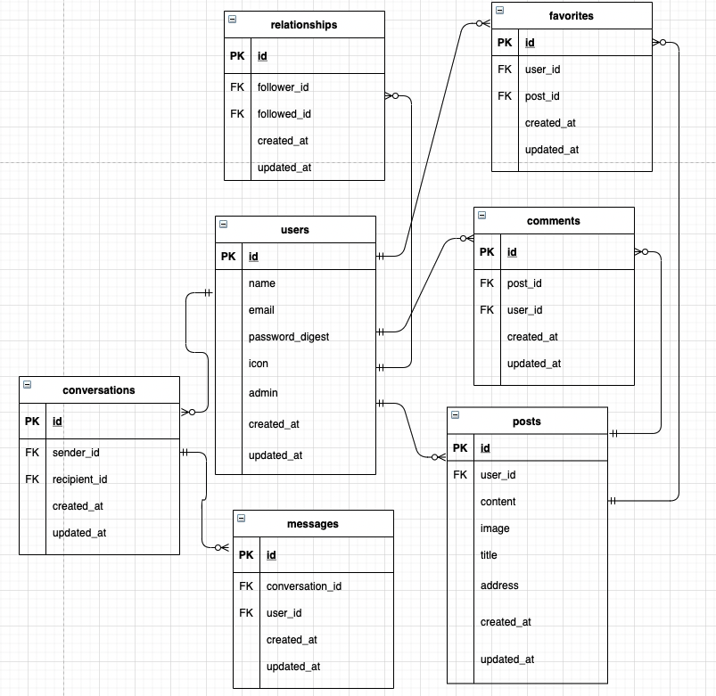
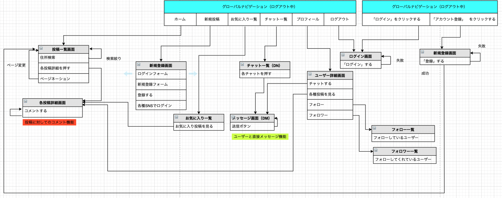

# README
### 実行手順
````
$ git clone https://github.com/syougo374/Connect.git 
$ cd Connect
$ bundle install
$ rails db:create && rails db:migrate
$ rails s
````


### タイトル
Connect

### コンセプト
地元のいい所、いい風景を紹介したい人と、その町について知りたい人を繋ぐアプリです。
直接チャットでやりとりを行い、その場所への行き方、混み具合、可能なら案内してもらうなど、新たなコミュニティーを構築する目的で作成。

### バージョン
- ruby2.6.5 
- rails5.2.5 
- postgresql 13.2

### 機能一覧
- ログイン機能
- ユーザーCRUD機能
- 投稿CRUD機能
- フォロー機能
- お気に入り機能
- メッセージ機能
- コメント機能

[カタログ設計](https://docs.google.com/spreadsheets/d/1zWUvTsntoSxx33IVawJI0GqJEZF2ndbEgixWF0hZ9j0/edit#gid=0)

[テーブル定義](https://docs.google.com/spreadsheets/d/1zWUvTsntoSxx33IVawJI0GqJEZF2ndbEgixWF0hZ9j0/edit#gid=1408983820)

[ER図](https://docs.google.com/spreadsheets/d/1zWUvTsntoSxx33IVawJI0GqJEZF2ndbEgixWF0hZ9j0/edit#gid=652702649)

[画面遷移図](https://docs.google.com/spreadsheets/d/1zWUvTsntoSxx33IVawJI0GqJEZF2ndbEgixWF0hZ9j0/edit#gid=295757362)

[ワイヤーフレーム](https://docs.google.com/spreadsheets/d/1zWUvTsntoSxx33IVawJI0GqJEZF2ndbEgixWF0hZ9j0/edit#gid=775796149)

### ER図


### 画面遷移図



### 要件就業Term２つ以上
- メッセージ機能
- フォロー機能

### カリキュラム外の技術
- Vue.js
    ↓変更（斉藤メンターより承認頂きました。）
- geocoder

### 使用予定Gem
- 国際化
gem 'devise-i18n'
gem 'rails-i18n', '~> 5.1'

- 画像投稿
gem 'carrierwave'
gem 'mimemagic'

- Googleマップ
gem 'dotenv-rails'
gem 'geocoder'
gem 'gon'
gem "gmaps4rails"
gem 'jquery-ui-rails'

- ページネーション
gem 'kaminari'

- 暗証番号のハッシュ化
gem 'bcrypt'

- デザイン関係
gem 'bootstrap', '~> 4.5'
gem 'jquery-rails'

- 検索機能
gem 'ransack'
